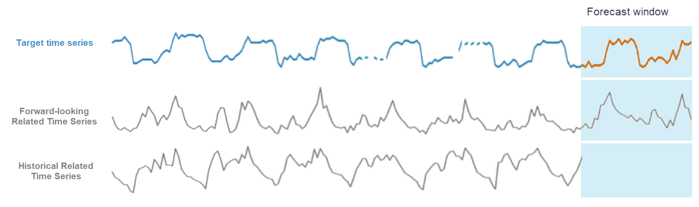
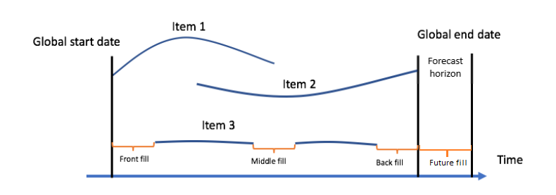
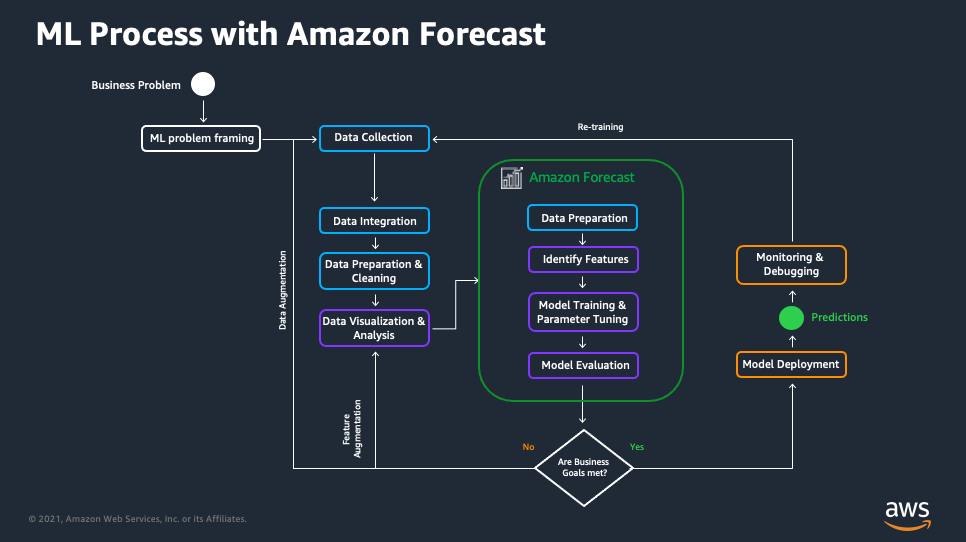

# **Amazon Forecast Data Set Guidance for Sales and Demand Planning**

This document will help you prepare your data and configure [Amazon Forecast](https://aws.amazon.com/forecast/) in the best way to fit your use-case. Two popular use cases for forecasting are sales forecasting in retail and demand planning for manufacturing.

[Amazon Forecast](https://aws.amazon.com/forecast/) is a fully managed service that uses machine learning to deliver highly accurate forecasts. Forecasting using machine learning uses historical series of data, also called time series data to predict future events, under the assumption that the future is determined by the past.

Based on the same technology used at Amazon.com, Amazon Forecast uses machine learning to combine time series data with additional variables to build forecasts. 

The first step to getting good forecasts is to have good quality relevant data. The aim of this document is to help you get started.

This document is provided to help you get the most out of your Amazon Forecast experience and is not a replacement for the official [Amazon Forecast Documentation](https://docs.aws.amazon.com/forecast/latest/dg/what-is-forecast.html).

If you are unsure if your use case is a good fit for Amazon Forecast, please refer to the [Amazon Forecast Introduction, Best Practices, and Cheat Sheet Tutorial](https://github.com/aws-samples/amazon-forecast-samples/blob/master/ForecastCheatSheet.md). 
 

## Multiple models, all in one service

In Amazon Forecast, you can immediately use different models, each of these covers different use cases and has different data requirements.

#### Baseline statistical algorithms: 

* [Auto-regressive integrated moving average (ARIMA)](https://docs.aws.amazon.com/forecast/latest/dg/aws-forecast-recipe-arima.html) - works well with small number of time series, for example, you want to make predictions about a few distinct items or customers.
* [Error Trend Seasonality (ETS)](https://docs.aws.amazon.com/forecast/latest/dg/aws-forecast-recipe-ets.html) -  works well with small number of time series, can find trends and seasonality
* [Non-Parametric Time Series (NPTS)](https://docs.aws.amazon.com/forecast/latest/dg/aws-forecast-recipe-npts.html) - Amazon proprietary algorithm, works well for intermittent spikes, and works well for sparse data

#### Flexible local algorithms:

* [Prophet](https://docs.aws.amazon.com/forecast/latest/dg/aws-forecast-recipe-prophet.html) - Open source algorithm by Facebook, can find trends, seasonality, as well as cyclical and holiday effects.

#### Neural Network algorithms (global models):

* [DeepAR+](https://docs.aws.amazon.com/forecast/latest/dg/aws-forecast-recipe-deeparplus.html) - Amazon proprietary algorithm, works best with large datasets of data with similar underlying patterns, and can identify seasonal effects and leverage related data. 
* [CNNQR](https://docs.aws.amazon.com/forecast/latest/dg/aws-forecast-algo-cnnqr.html) - Amazon proprietary algorithm, works best with large datasets of data with similar underlying patterns, and can identify seasonal effects and leverage related data. 

> Note: Classical forecasting techniques such as ARIMA and ETS fit one model to each individual time series. DeepAR+ and CNNQR create global models that take into account the relationships between the time series, and with the related time series and item metadata.

> DeepAR+ is only available in Amazon Forecast because it has additional refinements over [DeepAR on SageMaker](https://docs.aws.amazon.com/sagemaker/latest/dg/deepar.html) to make it more suited to out-of-the-box forecasting without much extra tuning.

## What are the datasets you can use with Amazon Forecast?

The largest abstraction of data you have in Amazon Forecast is the [dataset group](https://docs.aws.amazon.com/forecast/latest/dg/API_CreateDatasetGroup.html). This is a logical container for all your datasets, models and forecasts. Think of it as a folder where you organize your data for a particular forecast.

You can use 4 types of datasets with Amazon Forecast: target time series, item metadata, related time series and supplementary features datasets. These are defined by their [dataset type](https://docs.aws.amazon.com/forecast/latest/dg/howitworks-domains-ds-types.html).

A simple time series is a collection of item_ids, values and timestamps, where for each item_id and timestamp pair, there is one associated value. Time series have multiple timestamps and values for each item_id:

|item_id	|timestamp	|value	|
|---	|---	|---	|
|1	|1/1/2021	|10	|
|1	|2/1/2021	|20	|
|1	|3/1/2021	|10	|
|2	|1/1/2021	|55	|
|2	|2/1/2021	|80	|
|2	|3/1/2021	|40	|

A more complex time series may have additional dimensions, so that you don’t just have a unique value for each timestamp x item_id combination, but rather a value for each timestamp x item_id x dimension combination:

|item_id	|timestamp	|location	|value	|
|---	|---	|---	|---	|
|1	|1/1/2021	|London	|10	|
|1	|2/1/2021	|London	|20	|
|1	|3/1/2021	|London	|10	|
|1	|1/1/2021	|Paris	|12	|
|1	|2/1/2021	|Paris	|18	|
|1	|3/1/2021	|Paris	|15	|
|2	|1/1/2021	|London	|55	|
|2	|2/1/2021	|London	|80	|
|2	|3/1/2021	|London	|40	|
|2	|1/1/2021	|Paris	|77	|
|2	|2/1/2021	|Paris	|80	|
|2	|3/1/2021	|Paris	|60	|

In Amazon Forecast, the **target time series (TTS)** dataset are the time series that have the historical values of the type you want to predict. This is the primary and only mandatory dataset.

**[Item metadata](https://docs.aws.amazon.com/forecast/latest/dg/item-metadata-datasets.html)** is an optional dataset you can provide to improve your forecast. Here you will specify attributes, related to the items that are not-time varying. Item metadata has the same item_ids as the target time series. These attributes establish relationships or similarities between items.

> **Note:** A good dimension is one that applies to **more than one item**. Good: Colour, Category. Bad: item name.

> **Note**: Item metadata is particularly useful to use transfer learning to help better forecast cold items and items with little historical data.

|item_id	|category	|colour	|
|---	|---	|---	|
|1	|shirt	|blue	|
|2	|sun glasses	|green	|

Models that support [item metadata](https://docs.aws.amazon.com/forecast/latest/dg/item-metadata-datasets.html): CNN-QR, DeepAR+

The **[related time series](https://docs.aws.amazon.com/forecast/latest/dg/related-time-series-datasets.html) (RTS)** dataset are time series with the same item-ids and dimensions as the target time series. The related times has values that vary in time, for instance: promotions. There are two types of related time series, historical related time series (corresponds to the timestamps in the historical data) and forward looking related time series (corresponds to the timestamps in the historical data and the timestamps for the period you want to forecast)

The related time series, has all the timestamp x dimension x item_id combinations as the target time series and can also have  additional timestamp x dimension x item_id combinations with timestamps covering the future forecast horizon. 

Since Amazon Forecast is not predicting any values of the related time series, some models require you to provide the future values so it can correctly use this information to forecast. Using the promotion example: telling the forecast that there were promotions in the past via a related time series, can help the model learn why demand was sometimes increased. Information about future promotions in the related time series can improve the forecast for those items. 

|item_id	|timestamp	|location	|Promotion	|
|---	|---	|---	|---	|
|1	|1/1/2021	|London	|1	|
|1	|2/1/2021	|London	|1	|
|1	|3/1/2021	|London	|0	|
|1	|1/1/2021	|Paris	|0	|
|1	|2/1/2021	|Paris	|0	|
|1	|3/1/2021	|Paris	|0	|
|2	|1/1/2021	|London	|1	|
|2	|2/1/2021	|London	|0	|
|2	|3/1/2021	|London	|1	|
|2	|1/1/2021	|Paris	|0	|
|2	|2/1/2021	|Paris	|0	|
|2	|3/1/2021	|Paris	|0	|

Models that support [related time series](https://docs.aws.amazon.com/forecast/latest/dg/related-time-series-datasets.html): 

The following models support historical related time series (i.e. you are providing only historical information and no forward-looking information): CNN-QR. 

The following models support forward looking related time series: CNN-QR, DeepAR+, Prophet. 

NPTS, ARIMA and ETS do not support using related time series.

Source: [Amazon Forecast Documentation - Related Time Series](https://docs.aws.amazon.com/forecast/latest/dg/related-time-series-datasets.html)

**[Supplementary Features](https://docs.aws.amazon.com/forecast/latest/dg/API_SupplementaryFeature.html)** are datasets provided by Amazon Forecast that you can use. Supplementary features are related time series for each item based on location.  Currently Amazon Forecast offers two types of supplementary features: [holiday featurization](https://docs.aws.amazon.com/forecast/latest/dg/holidays.html) ( holiday information based on location) and [weather index](https://docs.aws.amazon.com/forecast/latest/dg/weather.html).

Models that support supplementary features: CNN-QR, DeepAR+, or Prophet algorithms.

> Note: Supplementary features function similarly to related time series as they contain time varying data that may be different for different items.

## More data is usually better

### Collecting data over long periods of time

Except in rare cases, collecting data over longer periods of time is generally better than using a short time span to train the model. Depending on the forecasting model, you have different data requirements. Conversely, the data you have available may constrain what models you can use (and what AutoML will recommend).
 
Neural Network models require larger datasets to get the best results. If you are using DeepAR+ and CNN-QR Each time series should have a long history, ideally >300 data points and > 2 years of data if attempting to capture annual events. 

### More data for each point in time

Besides collecting data for a longer period of time, adding additional **relevant** data (i.e. data that influences the target value you are trying to predict) is better. Usually, this data will be added as item meta data (see [Getting your data ready - item metadata](#getting-your-data-ready-item)) or as a related time series  (see [Getting your data Ready - related time series](#getting-your-data-ready-rts)).

## Recent data is good, but only if it accurately reflects the future

Fresh data is usually good to use, because it is closest in time to the period you want to forecast and has the latest accurate information. However, be aware of possible outliers and effects that may be influencing your recent data that have not yet been codified or identified. Only use data that will help you reflect a future state. If you have recent data that is not representative, consider handling these outliers by excluding them from the model or replacing them with hisorical or averaged data. You can use Amazon Forecast to [handle missing values](https://docs.aws.amazon.com/forecast/latest/dg/howitworks-missing-values.html) (even if you removed them by design!)
 

## Historical data is good, but only if it accurately reflects the future

Even though many times adding large quantities of historical data leads to better models, it is important to consider if this data will accurately reflect the future. For instance, large historical time series of products that have been discontinued may create noise for the model and not improve the forecast.

If there are unusual events in the past it is sometimes useful to add a related time series to inform the model of additional information that could explain these anomalies, for instance adding `is_in_lockdown` can help the model take into account the effects of a pandemic.
 

> Note: The size of your historical data will also influence how far into the future you can forecast. The maximum forecast horizon for Amazon Forecast is the lesser of 500 data points or 1/3 of the target time series dataset length (CNN-QR, DeepAR+) or the length of the target time series dataset minus one (ETS, NPTS, Prophet, ARIMA). All service quotas can be found in[the documentation](https://docs.aws.amazon.com/forecast/latest/dg/limits.html).

## Data quality matters

These are data quality checks you should do on your data. Amazon Forecast can help you deal with some of these checks. However as you further refine your forecasts, you can find that you require more granularity and control.

### Inspecting your data

**Data points per time series** 

Using a histogram to visualize how many data points are available for each item can give you insights about your data. It is also useful to visualize, how many points are available for each item for each dimension combination. For instance if you are selling products in different stores and have provided `store_id` as a dimension, it is good practice to visualize how many datapoints there are for each item at each store.

**Dense vs. Sparse time series**

You can use the information from the histogram analysis to categorize your items into dense or sparse items and provide this as item metadata, letting the model know that these should be treated differently. 

If you have few data points for the majority of your time series, it will be harder for the model to create an accurate forecast. In this situation, it might be useful to select a subset of items with enough historical data to forecast instead of all items.

Neural network models work best on dense datasets.

**Data concentration**

Using a histogram visualization for all your data or separating it by dimension, can help you understand if there data is unevenly distributed, for example if you have more data in a region than another. You can use it to identify gaps, skewness, or anomalies. This can inform if you need to do additional data collection, could exclude certain locations from your model, or if you potentially want to split into multiple models.

**Fast vs. Slow moving**

Even if there are many data points for a particular item, there can be large variability in the quantities sold for each item (or item x dimension combination). It can be useful to indicate to the model if an item sells many units or not. You can categorize your items into fast or slow moving items and provide this as item meta data, letting the model know that these should be treated differently. This is especially helpful when predicting new cold start items.

### Missing values

There are several reasons why there may be missing values in your data. By missing value, we refer to an item_id x dimension x timestamp combination that is either missing (the row does not exist), or is present, but the value is not available (NA).

Missing values can be due to different causes:

* start of life of an item, it was not available for the whole historical data period because it only became available from a certain time point on.
* cold item, the item is not present in the historical data (see: [Making forecasts for cold/new items](#making-forecasts-cold-items))
* end of life  of and item, it was not available for the whole historical data period because it stopped being  available from a certain time point on.
* you are only recording sales events. i.e. a missing value represents no sales in your data.
* technical issue in the data capture and no value is available
* something else

This is a problem when trying to train a model, because the model cannot differentiate these scenarios, so you need to handle them or privide the model with additional information about what is happening at that time.

> Note: Why a particular value is missing will depend on your business and you should use your knowledge to improve your forecast..

You can handle these scenarios in different ways: 

* Use NaN for start of life, end of life, and cold items
* Use ‘0’ when the product is available but not sold 
* Use NaN when a product is not available (for instance, if it is out of stock or the shop is closed). 
* Use NaN when there was a technical issue, so this datapoint is ignored by the model.

*How Amazon Forecast can help you*:  Amazon Forecast supports you in filling missing values. It currently supports [four types of filling](https://docs.aws.amazon.com/forecast/latest/dg/howitworks-missing-values.html): frontfill, middlefill and backfill for the target time series;  middlefill, backfill, and futurefill for the related time series. You can indicate to Amazon Forecast how you would like to fill these values by adding a `Featurization`  when creating your predictor.  For the target time series, you can specify filling with zero, a particular value, mean, median, minimum value, maximum value and nan (not a number). For the related time series, you can specify filling with zero, a particular value, mean, median, minimum value and maximum value.

Source: [Amazon Forecast Documentation - Handling Missing Values](https://docs.aws.amazon.com/forecast/latest/dg/howitworks-missing-values.html)

> Note: Some filling methods are implemented by default, for instance middle and back filling with zeroes for the target time series. Please keep in mind that only one strategy for each fill type can be applied per time series attribute type. If you are not filling these in pre-processing, make sure that this logic makes sense for your use-case.

> Note: For both target and related time series datasets, mean, median, min and max are calculated based on a rolling window of the 64 most recent data entries before the missing values.  If this does not reflect your business, we recommend you pre-process your data before importing it to Amazon Forecast (an example of this would be if you have daily sales captured shops that close over the weekend, you would be averaging sales with the zero sales of the days when the shop was closed).

### <a name="handling-zeroes"/>Handling Zeroes

Make sure that when a value is ‘0’ you are providing the relevant information to the model. For instance, ‘0’ means there were no sales, but, was the product in-stock? Was the shop closed at that time? 

You can convert zeroes to NaN when appropriate and use related time series (`in_stock`, `opening_hours`) to teach the model the characteristics of your data.

### Invalid values

Sometimes your data may contain invalid values, due to technical or recording errors. Make sure you validate your data for invalid values.

* Should there be be negative values?
* Are floats possible or should all values be integers (or the opposite)?
* Are the values valid according to business knowledge (for example, should a certain value always be less than 1)
* Are your categories and dimensions normalized (for example, do you have different names for the same country, i.e. “USA”, “US” and “United States”)?

*How Amazon Forecast can help you*:  You can replace invalid values by NA and handle them as missing values ([see Handling Zeroes](#handling-zeroes)).

### Outlier handling

Outliers are valid values that fall outside the norm and are usually a one-time occurrence. Removing historical outliers when they they are unique events not likely to repeat in the future can improve your forecast.

*How Amazon Forecast can help you*: You can replace outlier values in your data with N/A and use some of the Amazon Forecast filling strategies to handle them. A popular strategy is to use `"middlefill": "median"` to interpolate the value.

## Business insights matter

You know your business better than anyone and you have been predicting demand based on your business knowledge. You can leverage this knowledge to add features or related time series to your data. 

### Adding data to related time series

Related time series is information that changes over time, for instance, was there was a promotion in a certain period of time, information wether an item is in or out of season.

### Adding item metadata

Item metadata is static information about the item. Business knowledge about item characteristics that influence the values to be forecasted can be added. For example: item category, wether it is a luxury item or not, intended for children or adults, etc...
 

## Use the right data frequency 

Forecast frequency is the interval between the measured values to be forecasted. This could be anywhere from one minute to one year (or more!). If your historical data is of greater frequency than the forecast frequency, it can be aggregated.

> Note: Make sure to specify how to correctly aggregate your data.[Amazon Forecast has multiple strategies for aggregation](https://docs.aws.amazon.com/forecast/latest/dg/howitworks-datasets-groups.html), such as average and sum.

Aggregate your data to a frequency that makes sense for your business. 

*How Amazon Forecast can help you*: [Amazon Forecast supports aggregation](https://docs.aws.amazon.com/forecast/latest/dg/howitworks-datasets-groups.html) of your data using the `FeaturizationMethod` API. There are different aggregation strategies, for retail forecasting, usually “sum” is used, but in some cases “average” may be appropriate. [By default, the forecast frequency is the data collection frequency that you specified](https://docs.aws.amazon.com/forecast/latest/dg/howitworks-forecast.html) when you created the dataset, however, you can also specify a frequency that is greater (but not lesser!).

## Select the correct forecast horizon

The forecast horizon is how far into the future the model will be predicting values. For example, a forecast horizon can be a week, a month or a year. Make sure that you select a forecast horizon that reflects your business case.

Avoid using forecast horizons that are too big, because they will increase training time and reduce accuracy, consider aggregating at a higher frequency if your business case requires you to look further into the future. For example, use 5min frequency instead of 1min frequency. For DeepAR+ less than 400 timestamps is recommended, for CNN-QR less than 100 timestamps is recommended.

> Note: As expected, the farther into the future you want to predict, the harder it is to forecast. Always pick the smallest possible horizon for your business.

## <a name="what-if"/>What data to use for what-if scenarios 

When forecasting, you may want to inspect different what-if scenarios (also known as sensitivity analysis), for example what wold happen if the price is lowered, or if there is a promotion?

You can do this in Amazon Forecast by manipulating forward looking related timeseries.

This does not mean that you need to know the future to make good predictions, what-if scenarios let you make better business decisions because you can forecast with multiple futures and compare the impact.

For instance, you can compare the effects of applying a promotion or not by creating two forecasts, one with  `promotion_applied = 1` and and one with `promotion_applied = 0`  for the timestamps in the future.  Then you do the forecast and can compare the effects. A notebook with an example of[sensitivity analysis can be found in the Amazon Forecast Samples repository](https://github.com/aws-samples/amazon-forecast-samples/tree/master/notebooks/advanced/WhatIf_Analysis). 

## <a name="making-forecasts-cold-items"/>Making forecasts for cold/new items 

Some advanced Forecast models (CNN-QR and DeepAR+) can use transfer learning using historical data from similar items to help forecast values for new items. If you want to forcast cold items, you need to provide item-metadata, so the model can learn what items are similar to each other.

You need at least 5 rows of an item in the TTS to make a forecast for an item, even if you have the item in the item dataset. You can put NaN as the value. NaN will mean these rows are not included in the model training.

|tiemstamp	|item_id	|target_value	|
|---	|---	|---	|
|01.11.2020	|998	|NaN	|
|01.12.2020	|998	|NaN	|
|01.01.2021	|998	|NaN	|
|01.02.2021	|998	|NaN	|
|01.03.2021	|998	|NaN	|

This will make sure the item is known to the model and future values forecasted.

## <a name="getting-your-data-ready"/>Getting your data ready

You can use one of the [predefined domains](https://docs.aws.amazon.com/forecast/latest/dg/howitworks-domains-ds-types.html) to help you select the relevant data for your forecast or you can create a [custom domain](https://docs.aws.amazon.com/forecast/latest/dg/custom-domain.html) that reflects the particular forecasting needs of your business.

### <a name="getting-your-data-ready-tts"> Target Time series

The target time series (TTS) dataset are the time series that have the historical values of the type you want to predict.
 
**Required fields**
 

* `item_id `(string)
* `timestamp `(timestamp)
* `sales` (float)

You can add addtional dimensions to your TTS. You can specify up to 10 dimensions. By default Amazon Forecast considers no dimensions (for example, forecast sales in the whole USA). 

**Recommended fields**

`location` (string). In many retail situations, there are multiple locations where an item is sold. Adding location as a dimension can help to create more accurate forecasts. (`state` and `zip_code` are examples of locations)

**Other fields, if it makes sense for your business**
 
`region` (string). In some retail situations there may be commonalties in sales behaviour across multiple locations. Adding region information as a dimension can help improve forecast in these cases.

Data types: timestamp, string, float, integer

*How Amazon Forecast can help you*: [Amazon Forecast has multiple strategies for aggregation](https://docs.aws.amazon.com/forecast/latest/dg/howitworks-datasets-groups.html), such as average and sum. Keep in mind that you can aggregate but not dilate. You can go from hourly data to daily, but not from monthly data to daily.

>  Note: All dimensions are categortical!

### <a name="getting-your-data-ready-item"/>Item Metadata

This type of data is optional, but encouraged to improve your forecast.
 
**Required fields**

* `item_id `(string)
* value (requires to provide at least one  value, can be `string`, `integer`, `float`, `timestamp`, `geolocation`)

 
**Recommended fields**

* `is_fast_moving_item` (integer; 1=true, 0=false) You can calculated if your item is 
* `is_sparse_item` (integer; 1=true, 0=false)
* `category` (string)
* `brand` (string)
* `color` (string)
* `genre` (string)

>  Note: All metadata fields are categorical!

 
**Other fields, if it makes sense for your business**

* `is_winter_seasonal/is_summer_seasonal` (or autumn, spring) (integer; 1=true, 0=false). Think for example of sunglasses or ski gear, seasonality plays an important role. This type of metadata can be especially useful when predicting sales for seasonal cold items. Alternatively t is possible to provide similar information using a related time series. 

### <a name="getting-your-data-ready-rts"/>Related time series 

Related time series (RTS) are time varying values related to each item_id x timestamp x dimension. This type of data is optional, but encouraged to improve your forecast.

The frequency of the RTS must match forecast granularity. For example, if you want a daily forecast, you have to have a daily granularity. Amazon Forecast can help you [aggregate your data to the right frequency](https://docs.aws.amazon.com/forecast/latest/dg/howitworks-datasets-groups.html#howitworks-data-alignment).

> **Note**: Do not discard using related time series if you don’t have the future values, this is an opportunity to explore different scenarios (see: [What data to use for what-if scenarios](#what-if) ).

> **Note**: Make sure that you provided Forward looking time series where required (more information and examples in the [documentation](https://docs.aws.amazon.com/forecast/latest/dg/related-time-series-datasets.html)).

**Required fields**

* `item_id `(`string`) 
* All dimension fields (`string`)
* `timestamp `(`timestamp`)
* value (at least one  value, [can only be `float` or `integer` type](https://docs.aws.amazon.com/forecast/latest/dg/related-time-series-datasets.html))

**Recommended fields**

* `in_stock` (integer; 1=true, 0=false). This helps the model differentiate between zero sales because the product was not available and zero sales because there was no demand for the product.
* `price`. Price usually strongly influences sales.
* `working_hours` (integer; 1=open, 0=closed) Can indicate opening hours of a shop to help the model learn when lack of sales are because of lack of demand or because the shop is not open.
* `promotion_applied `(integer; 1=true, 0=false). Use this if you have promotions not captured by price changes, such as marketing events or publicity.
* `in_season` (integer; 1=true, 0=false). Seasonality of items can help improve your forecast.
* `holiday_calender` You can use a custom holiday calendar or the [supplementary feature](https://docs.aws.amazon.com/forecast/latest/dg/holidays.html) by Amazon Forecast.
* `weather `You can use a cusom holiday calendar or the [weather index dataset](https://docs.aws.amazon.com/forecast/latest/dg/weather.html)by Amazon Forecast.

**Other fields that can be calculated from your data**

Sometimes it can improve the forecast if you provide lag features to the model. Lag features are variables that contain data from prior time steps. For the same metric, you can provide past values (for example 1-7d, 1-52w, 1-12m, 1-3y ago) as additional columns in each row. They can also go further into the past than the training time window specified if data is available. Lag features can also be averages over a moving window of time.

*How Amazon Forecast can help you*: Some models you can select in Amazon Forecast do the heavy lifting and create lag features for you ([for example DeepAR+](https://docs.aws.amazon.com/forecast/latest/dg/aws-forecast-recipe-deeparplus.html))

## Single model vs. separating your data into multiple models

Sometimes you can improve your forecast by separating it into multiple models. One popular separation is to do a model for all fast-moving items and another for all slow-moving items, this is because network models tend to converge and these sometimes average each other out, especially if you don’t have `is_fast_moving_item` as a feature in your metadata or related time series.

## Optimize your Forecast Based on Business Metrics

Sometimes not all items are of equal importance, and instead of forecasting the long tail of retail, it can be useful to identify your top items and to pick the model that serves them best. 

This can be accomplished in two ways:

* Select a subset of your items and train a model only with those items, so the model is optimized for them
* Before deciding among different models, pick the one that best performs on the items you care about most.

Another popular metric is selecting a model that drives the highest revenue overall by taking into account the item revenue and sales.

## Iterative nature of AI/ML projects

When using ML in your business it is necessary to keep in mind that the first model you train is most likely not going to be your final model. Amazon Forecast takes care of much of the forecasting heavylifting for you: data preparation, identifying features, model training and parameter tuning and model evaluation as well as proiving you with a console where you can easily train and inspect your models and forecasts. However, you may have to do several iterations, adding additional business knowledge, data clean-up and parameters before you find the model that best meets your business goals.

## FAQs

### 1. What AWS Services can I use to prepare my data?

[**AWS Glue**](https://aws.amazon.com/glue/) is a serverless data integration service that makes it easy to discover, prepare, and combine data for analytics, machine learning, and application development.

**[Amazon SageMaker](https://aws.amazon.com/sagemaker/)** can be used to host and experiment with data preparation using notebooks in many of the poipular programming languages.

**[Amazon SageMaker Data Wrangler](https://aws.amazon.com/sagemaker/data-wrangler/)** you can simplify the process of data preparation and feature engineering, and complete each step of the data preparation workflow, including data selection, cleansing, exploration, and visualization from a single visual interface.

**[Amazon Athena](https://aws.amazon.com/athena/)** is an interactive query service that makes it easy to analyze data in Amazon S3 using standard SQL. Athena is part of the S3 data lake, a recommended storage entry point for AI/ML jobs. It is possible to do data preparation using SQL.

[**Amazon EMR**](https://aws.amazon.com/emr/?whats-new-cards.sort-by=item.additionalFields.postDateTime&whats-new-cards.sort-order=desc) is the industry-leading cloud big data platform for processing vast amounts of data using open source tools.  You can use EMR when you are processing really large data. EMR is suitable for more experienced builders.

### 2. My model under-forecasts continuously or is zero?

Add information when the items was out of stock, or when the store is closed. Also, aggregating at a higher frequensy can help (hourly to daily or daily to monthly).

Your dataset may be unbalanced, and the model is averaging disparate values. You may have many slow-moving items, and you should add this information as item metadata. Or you can add features such as winter or summer item to indicate to the model it should treat them differently. You can also try to split the model into multiple models.

### 3. My model over-forecasts continuously?

Your dataset may be unbalanced, and the model is averaging disparate values. You may have many fast-moving items, and you should add this information as item metadata. Or you can add features such as winter or summer item to indicate to the model it should treat them differently. You can also try to split the model into multiple models.

### 4. NPTS is outperforming other models?

You may have a sparse dataset because of many NaNs or missing values. Consider using featurization to fill in those values with something that makes sense for your data and business case. Also, aggregating at a higher frequensy can help (hourly to daily or daily to monthly).

### 5. My model is not forecasting Cold Items?

Verify that the model is compatible with cold items, only CNNQR and DeepAR+ can forecast cold items, because they are networks and take into account the information from all items to forecast each time series. Make sure there are at least 5 data points in the TTS for these items, even if their values is unknown and set to “NaN” so that Amazon Forecast can register these items.

### 6. My forecast does not contain all my items?

Make sure there are at least 5 data points in the TTS for these items.

