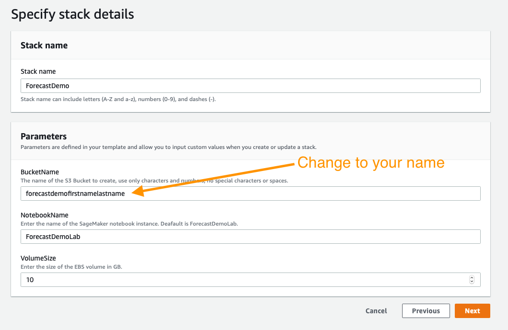
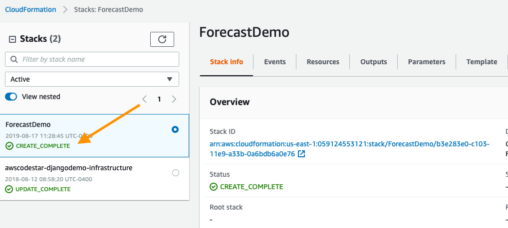

## Outbrain Revenue Forecast

A POC to forecast Outbrain revenues using [Amazon Forecast](https://aws.amazon.com/forecast/). 

See the POC Inception [here](https://cnissues.atlassian.net/wiki/spaces/FP/pages/609550359/Algorithmically+optimize+the+position+of+Outbrain+vs+Recs+based+on+RPM+R.A.T.+Inception)

See the [Forecast developer guide](https://docs.aws.amazon.com/forecast/latest/dg/what-is-forecast.html)

Note that this repository is a fork of https://github.com/aws-samples/amazon-forecast-samples.

## Agenda

The steps below outline the process of building the time-series prediction models, evaluating them, and then cleaning
 up the resources. To get started execute the following steps.

1. Deploy the CloudFormation Template below or build a local Jupyter environment with the AWS CLI installed and configured for your IAM account.
1. `1.Getting_Data_Ready.ipynb` - Guides you through preparing the Outbrain dataset to be used with Amazon Forecast.
1. `2.Building_Your_Predictor.ipynb` - Explains how to use the dataset prepared to build the models.
1. `3.Evaluating_Your_Predictor.ipynb` - Takes the models just created and evaluates its performance against real
 observed measurements.

Each notebook can be found within the `notebooks` folder in this project.

## Outline

1. First deploy a CloudFormation template that will create an S3 bucket for data storage, a SageMaker Notebook Instance where the exercises are executed, IAM policies for the Notebook Instance, and it will clone this repository into the Notebook Instance so you are ready to get started.
1. Next open the `Getting_Data_Ready.ipynb` to get started.
1. This notebook will guide you through the process of the other notebooks until you have a working and evaluated forecast.

Note that we are using the `CNI-Experimental` AWS account for the POC evaluation. 

## Building the Environment:

As mentioned above, the first step is to deploy a CloudFormation template that will perform much of the initial setup work for you. 

In another browser window or tab, login to the AWS account. Once you have done that, open the link below in a new tab
 to start the process of deploying the items you need via CloudFormation.

Follow along with the screenshots below if you have any questions about deploying the stack.

### Cloud Formation Wizard

Start by clicking `Next` at the bottom like this:

In the next page you need to provide a unique S3 bucket name for your file storage, it is recommended to simply add your first name and last name to the end of the default option as shown below, after that update click `Next` again.

This page is a bit longer so scroll to the bottom to click `Next`.

Again scroll to the bottom, check the box to enable the template to create new IAM resources and then click `Create Stack`.

For a few minutes CloudFormation will be creating the resources described above on your behalf it will look like this while it is provisioning:

Once it has completed you'll see green text like below indicating that the work has been completed:

Now that you have your environment created, you need to save the name of your S3 bucket for future use, you can find it by clicking on the `Outputs` tab and then looking for the resource `S3Bucket`, once you find it copy and paste it to a text file for the time being.

