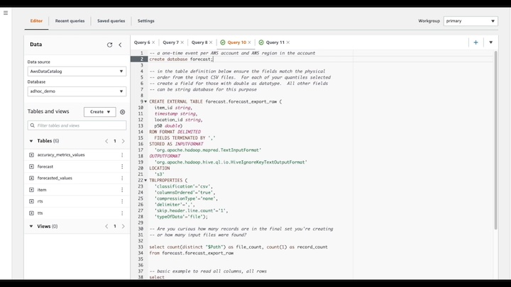

## Using Amazon Athena to consolidate data exported by Amazon Forecast

The [Amazon Forecast](https://aws.amazon.com/forecast/) service was built to serve customer forecasting needs at every scale.  As such, the service often provisions clusters of various sizes (vertical scaling) and nodes (horizontal scaling) to handle all aspects of data imports, model training, and time-series predictions.  **Figure 1** depicts the distributed architecture in action with shared-nothing readers generating forecasted data points and writing them to S3 in parallel.

The purpose of this page is to demonstrate methods that allow multiple outputs to be consolidated into a single entity, where the right side of the illustration represents a single consolidated dataset.


<br>
*Figure 1: Parallel Readers and [S3] Writer Processes Reduce Total Runtime*

## Video Demonstration

[](https://amazon-forecast-samples.s3.us-west-2.amazonaws.com/demo_videos/Amazon_Athena_Export_Consolidation.mp4)


## Use Amazon Athena to read raw CSV (or Parquet)
Start by selecting the Athena service in the region where your AWS S3 bucket exists that holds your Amazon Forecast input or output datasets.  This example shows reading output Forecast data points, but the same concept would apply to query your input TTS, RTS, Item metadata -- or also query your backtest exports or explainability.

1. In the Athena editor, create a database to hold your Amazon Forecast tables defined in subsequent steps.  This is generally a one-time event per AWS account and AWS region.
```
create database forecast;
```
2. Create a table with a schema that matches your raw files.   This example is for CSV files produced during an Amazon Forecast Export job.  Take care to edit this example so it matches your dimensions (i.e. item_id and location_id in this example), and forecasted quantiles (i.e. only p50) in this example.  You will also need to edit the S3 location to the bucket and folder.
```
CREATE EXTERNAL TABLE forecast.forecast_export_raw (
  item_id string, 
  timestamp string, 
  location_id string, 
  p50 double)
ROW FORMAT DELIMITED 
  FIELDS TERMINATED BY ',' 
STORED AS INPUTFORMAT 
  'org.apache.hadoop.mapred.TextInputFormat' 
OUTPUTFORMAT 
  'org.apache.hadoop.hive.ql.io.HiveIgnoreKeyTextOutputFormat'
LOCATION
  's3://your-bucket-here/folder/folder/'
TBLPROPERTIES (
  'classification'='csv', 
  'columnsOrdered'='true', 
  'compressionType'='none', 
  'delimiter'=',', 
  'skip.header.line.count'='1', 
  'typeOfData'='file');
```
3. Now you can issue ad-hoc SQL queries against your raw data!
4. Once you have executed an Amazon Athena query, you can download the results from the Athena user interface or leverage the consolidated output in S3.
5. You might also choose to analyze this data in [Amazon QuickSight](https://aws.amazon.com/quicksight/) or your BI tool of choice.

## Example Ad-hoc Queries

Are you curious about how many records are in the final set you're creating or how many single CSV (Parquet) input files were found on S3?
```
select 
count(distinct "$Path") as file_count, 
count(1) as record_count
from forecast.forecast_export_raw
```

This is the most basic example to read all columns, all rows.
```
select 
*
from forecast.forecast_export_raw
```

A better example.  Here you can convert dimensions to upper-case if desired.  You can choose the date format desired in your single output CSV.  You can you also round the forecasted data points and replace negative numbers with a zero if desired.  These are some starter ideas, please reach out to your AWS Solution Architect for any questions.

More help with Amazon Athena queries is located [here](https://docs.aws.amazon.com/athena/latest/ug/select.html).
```
select 
upper(item_id) as item_id,
upper(location_id) as location_id,
from_iso8601_timestamp(timestamp) timestamp_format1, 
DATE_FORMAT(from_iso8601_timestamp(timestamp),'%Y-%m-%d %H:%i:%s') timestamp_format2,
DATE_FORMAT(from_iso8601_timestamp(timestamp),'%Y-%m-%d') timestamp_format3,
case
when p50 < 0 then 0
else round(p50,2) 
end as p50
from forecast.forecast_export_raw
```

