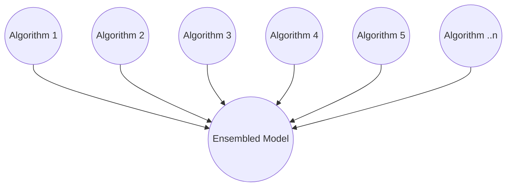

#  Amazon Forecast AutoPredictor

The goal of time-series forecasting, is to build a model from prior data that can make generalized predictions about future unseen data with the least amount of error in prediction. In the time-series discipline, error is often expressed as the difference between a predicted value and an actual value.

**Milestone 1: Launch of Amazon Forecast**
When Amazon Forecast was initially launched, it offered many time-series algorithms to help learn patterns in data to predict future values. Some of these algorithms are established statistical methods; others are state-of-the-art neural networks. As a result of differing algorithms, there are different outcomes and different degrees of accuracy with each. At service launch, customers had to explore algorithms and determine which was the best for their use case. They manually selected an overall winner to forecast their data. All time-series received predictions from the same algorithm.

**Milestone 2: Amazon Forecast launches AutoML**
At AWS, we look for ways to improve customer experiences and reduce time customers spend doing work that adds no value to their core business mission. With this in mind, AutoML was launched, which allowed Amazon Forecast customers to request the service run all underlying base models and identify the champion. Once again, the winning algorithm was applied to all time-series included in the customer's data set. AutoML was useful to make finding the winning algorithm simpler, but a key distinction remained -- all time series had the same algorithm underneath.

**Time Series have unique qualities**
Customers can provide dozens, to hundreds, to thousands of time-series in a dataset. Each time-series has unique qualities, to name a few:

 - the number of observations of data --  newly released products versus established products
 - the frequency of data -- some items sell frequently, while others are slow movers.
 - more or less volatility in demand

As a result, different algorithms may benefit different styles of time-series. There was a need to be more surgical and give each series the best algorithm -- and not settle for one size fits all.  Enter AutoPredictor.

**Milestone 3: Amazon Forecast launches AutoPredictor**
With this in mind, in November 2021, [Amazon Forecast introduced AutoPredictor](https://aws.amazon.com/blogs/machine-learning/new-amazon-forecast-api-that-creates-up-to-40-more-accurate-forecasts-and-provides-explainability/), which continued to bring innovation to customers.  AutoPredictor (Figure 1) runs all underlying base models and then performs an ensemble routine at every single time-series in the set.  Each time series can receive a bespoke recipe that can blend predictions from more than one base model. In short, each time-series has a perfected model to match its signature, with a goal of improving accuracy at every single series.

**Figure 1: AutoPredictor Ensembled Model -- Each Time-Series uses Bespoke Blend of Base Models**

AutoPredictor is the standard and includes many additional features not available in the Legacy models.  As the Amazon Forecast service continues to innovate, new features will be supported only by the AutoPredictor method.

Helpful links:

 - [Boto3 create_auto_predictor reference](https://boto3.amazonaws.com/v1/documentation/api/latest/reference/services/forecast.html#ForecastService.Client.create_auto_predictor)
 - [Amazon Forecast Developer Guide](https://docs.aws.amazon.com/forecast/latest/dg/API_CreateAutoPredictor.html)
 - [Amazon CLI Command Reference](https://awscli.amazonaws.com/v2/documentation/api/latest/reference/forecast/create-auto-predictor.html)
 - [Sample QuickStart Guide to Train an AutoPredictor](../../notebooks/basic/Getting_Started/Amazon_Forecast_Quick_Start_Guide.ipynb)
