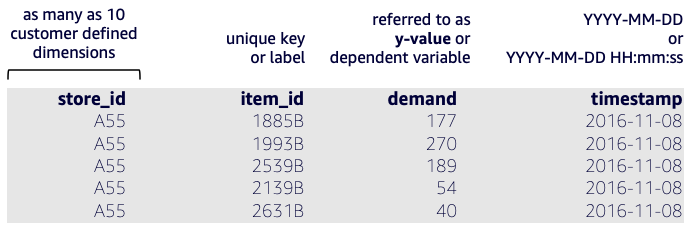
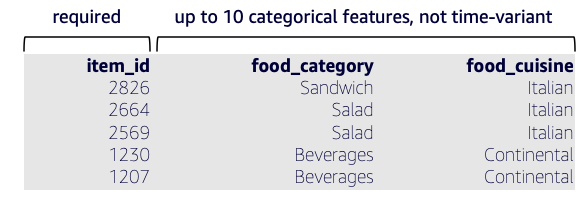


# Mapping your data into Amazon Forecast datasets

##### Table of Contents  

* [Dataset group](#datasetgroup)  
* [Target Time Series](#tts)  
* [Related Time Series](#rts)
* [Item Metadata](#im)
* [AWS supplied dataset: Weather Index](#weather)

## Dataset group<a name="datasetgroup"/>
A  _dataset group_ is a collection of one to three complimentary datasets, one of each dataset type.  You import datasets to a dataset group, then use the dataset group to train a predictor and generate forecasts.  Ultimately, the dataset group is a self-contained unit that holds all related Amazon Forecast artifacts for a single workload including data, ML model and inference.  Customers may create many dataset groups, one for each workload, where a shared-nothing design is needed. 
<br>There are three dataset types: [target time series](#tts), [related time series](#rts) and [item metadata](#im) defined within.  The only required dataset type is **target time series**.

## Target Time Series (TTS)<a name="tts"/>

In Amazon Forecast, historical event data is called the Target Time Series (TTS).  This the only required dataset type required to do forecasting and contains the signal for which you want to produce a future-dated forecast. 
<br>
TTS consists of:
  - An **"item_id", which is a unique identifier for the things you want to forecast**.  The unique identifier can represent distinct products, services, KPI measures/metrics, geography, customers and more.  The field can be a concatenation of fields to form a unique time series identifier.  You may also define dimensions to prevent the need to concatenate.  This feature communicates "*what*".
  - Also a **"timestamp" when the historical event occurred**.  Two timestamp formats are supported, as illustrated in Figure 1.  If you are forecasting below daily grain, you will need to provide timestamps with HH:mm:ss precision.  This feature communicates "*when*".
  - And a **"target_value" that expresses the quantity of the event**.  These continuous values can be integer or decimal (float) numbers.  This feature communicates "*how much*".

In addition, you may specify up to 10 columns that provided added dimensions for more granularity.  An example is shown in Figure 1, where in addition to item_id, a store number is specified.   You may define these according to your hierarchy as needed.

***Figure 1 - Example of TTS with sample data records***
<br>


You are able to define your TTS with JSON; this example supports the Figure 1 schema.
```
{
  "Attributes": [
    {
      "AttributeName": "store_id",
      "AttributeType": "string"
    },
    {
      "AttributeName": "item_id",
      "AttributeType": "string"
    },
    {
      "AttributeName": "target_value",
      "AttributeType": "integer"
    },
    {
      "AttributeName": "timestamp",
      "AttributeType": "timestamp"
    }
  ]
}
```

## Optional: Related Time Series (RTS)<a name="rts"/>

In addition to historical data, **sometimes other data is known per item at exactly the same time.  This is called the Related Time Series (RTS)**.  Related data can give more clues to what future predictions could look like.  The best related data is also known and specified in the future.  For example unit prices, sale/promotions, marketing spend, economic indicators, holidays, traffic patterns, available inventory level.  

There are important distinctions with the RTS dataset:

-   The frequency at which data is recorded in the related time series dataset must match the interval at which you want to generate forecasts (the forecasting  _granularity_).
    
    For example, if you want to generate forecasts at a weekly granularity, the frequency at which data is recorded in the related time series must also be weekly, even if the frequency at which data is recorded in the target time series is daily.

 - The demarcation line between history and future is set from the maximum timestamp observed in the imported TTS dataset.
 - A future dated RTS, through the end of the forecast horizon is highly encouraged to produce a most effective model.  Some of the underlying base models require a future RTS to make use of the overall RTS dataset.

**For a more comprehensive list of considerations, visit the [related time series documentation](https://docs.aws.amazon.com/forecast/latest/dg/related-time-series-datasets.html) page.**

***Figure 2 - Example of RTS with sample data records***
<br>


You are able to define your RTS with JSON; this example supports the Figure 2 schema.
```
{
  "Attributes": [
    {
      "AttributeName": "location_id",
      "AttributeType": "string"
    },
    {
      "AttributeName": "item_id",
      "AttributeType": "string"
    },
    {
      "AttributeName": "checkout_price",
      "AttributeType": "float"
    },
    {
      "AttributeName": "base_price",
      "AttributeType": "float"
    },
    {
      "AttributeName": "emailer_for_promotion",
      "AttributeType": "integer"
    },
    {
      "AttributeName": "homepage_featured",
      "AttributeType": "integer"
    },
    {
      "AttributeName": "timestamp",
      "AttributeType": "timestamp"
    }
  ]
}
```

## Optional: Item Metadata (IM)<a name="im"/>

Especially for cold-starts, or new product introductions, it is important to have Item Metadata (IM).  **Item Metadata is static information with respect to time, it varies only per fixed "item_id"**.  Examples of metadata are type of item, product group, genre, color, class.

***Figure 3 - Example of Item Metadata with sample data records***
<br>


You are able to define your IM with JSON; this example supports the Figure 3 schema.
```
{
   "Attributes":[
      {
         "AttributeName":"item_id",
         "AttributeType":"string"
      },
      {
         "AttributeName":"food_category",
         "AttributeType":"string"
      },
      {
         "AttributeName":"food_cuisine",
         "AttributeType":"string"
      }
   ]
}
```
**For a more comprehensive list of considerations, visit the [item metadata documentation](https://docs.aws.amazon.com/forecast/latest/dg/item-metadata-datasets.html) page.**

## AWS supplied dataset: Weather Index<a name="weather"/>

The Amazon Forecast Weather Index is a built-in featurization that incorporates historical and projected weather information into your model.  It is especially useful for retail use cases, where temperature and precipitation can significantly affect product demand.

When the Weather Index is enabled, Forecast applies the weather featurization only to time series where it finds improvements in accuracy during predictor training.  If supplementing a time series with weather information does not improve its predictive accuracy during backtesting, Amazon Forecast does not apply the Weather Index to that particular time series.

To apply the Weather Index, you must 

 - include a  [geolocation attribute](https://docs.aws.amazon.com/forecast/latest/dg/weather.html#adding-geolocation)  in your target time series dataset and any related time series datasets.  
 - specify  [time zones](https://docs.aws.amazon.com/forecast/latest/dg/weather.html#specifying-timezones)  for your target time-series timestamps.

For more information regarding dataset requirements, see  [Conditions and Restrictions](https://docs.aws.amazon.com/forecast/latest/dg/weather.html#weather-conditions-restrictions).

**For a more comprehensive list of considerations, visit the [weather index](https://docs.aws.amazon.com/forecast/latest/dg/weather.html#adding-geolocation) page.**


<br><br>
[Return to Table of Contents](../README.md)
