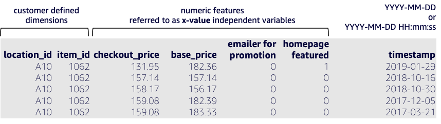


# Related Time Series (RTS)

In addition to historical data, **sometimes other data is known per item at exactly the same time.  This is called the Related Time Series (RTS)**.  Related data can give more clues to what future predictions could look like.  The best related data is also known and specified in the future.  For example unit prices, sale/promotions, marketing spend, economic indicators, holidays, traffic patterns, available inventory level.  

There are important distinctions with the RTS dataset:

-   The frequency at which data is recorded in the related time series dataset must match the interval at which you want to generate forecasts (the forecasting  _granularity_).
    
    For example, if you want to generate forecasts at a weekly granularity, the frequency at which data is recorded in the related time series must also be weekly, even if the frequency at which data is recorded in the target time series is daily.

 - The demarcation line between history and future is set from the maximum timestamp observed in the imported TTS dataset.
 - A future dated RTS, through the end of the forecast horizon is highly encouraged to produce a most effective model.  Some of the underlying base models require a future RTS to make use of the overall RTS dataset.

**For a more comprehensive list of considerations, visit the [related time series documentation](https://docs.aws.amazon.com/forecast/latest/dg/related-time-series-datasets.html) page.**

***Figure 2 - Example of RTS with sample data records***
<br>


You are able to define your RTS with JSON; this example supports the Figure 2 schema.
```
{
  "Attributes": [
    {
      "AttributeName": "location_id",
      "AttributeType": "string"
    },
    {
      "AttributeName": "item_id",
      "AttributeType": "string"
    },
    {
      "AttributeName": "checkout_price",
      "AttributeType": "float"
    },
    {
      "AttributeName": "base_price",
      "AttributeType": "float"
    },
    {
      "AttributeName": "emailer_for_promotion",
      "AttributeType": "integer"
    },
    {
      "AttributeName": "homepage_featured",
      "AttributeType": "integer"
    },
    {
      "AttributeName": "timestamp",
      "AttributeType": "timestamp"
    }
  ]
}
```


<br><br>
[Return to Datasets](./Datasets.md)
[Return to Table of Contents](../README.md)
