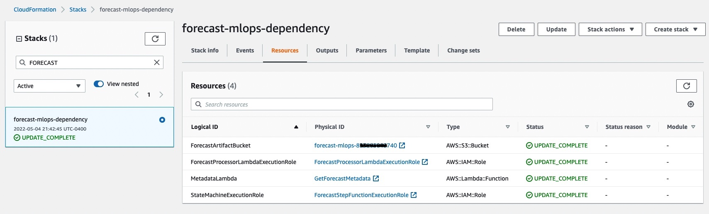

## Deploy the Amazon Forecast CloudFormation Permission Dependency Stack

1. In the AWS console, select the desired region for workload deployment.  The Amazon Forecast service is available in these [AWS Regions](https://docs.aws.amazon.com/general/latest/gr/forecast.html).  The region selector can be found, as a dropdown, right-of-center on the black menu bar in the AWS Console.  Choose the option that best meets your needs, but do take care to choose a region where AWS Forecast is available.
2.  From the AWS Console, navigate to the CloudFormation service.  You can do this by tying CloudFormation in the "search for services" control in the black menu bar.  Next, click the orange "Create Stack" button.
3. At stack creation, "[Step 1: Specify template](./images/create-solution-guidance-stack-1.jpg)", simply paste the URL string into the control as follows:

	 ```https://amazon-forecast-samples.s3.us-west-2.amazonaws.com/ml_ops/forecast-mlops-dependency.yaml```

	If needed, you may [download the file](https://amazon-forecast-samples.s3.us-west-2.amazonaws.com/ml_ops/forecast-mlops-dependency.yaml) locally or clone using git.

4. Click Next to continue.
5. At stack creation, "[Step 2: Specify stack details](./images/create-dependency-stack-2.jpg)" complete page details as follows:
	
	 - [ ] Stack name should be forecast-mlops-dependency
	 - [ ] If you already have a S3 bucket for this purpose, choose "true" for ExistingS3Bucket.  If you need a new bucket, select false (default).
	 - [ ] Provide a valid and unique S3 bucket name.  To ensure a globally unique S3 bucket name, some customers append a portion of their AWS account number or random alpha numeric digits.
	 - [ ] Click the next button to continue.
6. At stack creation, "Step 3: Configure stack options", go to the bottom of the page and click next.  No options are required to be changed here.
7. At stack creation, "[Step 4: Review](./images/create-dependency-stack-4.jpg)", check the box at the bottom to accept there will be resources created as part of the stack creation, and click next.
8. Review the resources created, which may include your S3 bucket, but will include one supporting Lambda function and two Forecast-related IAM roles.   You can click on any of the Physical ID links to review their definition.<br><br><br><br>

You are done with this one-time, per AWS account step.  You may proceed to the next step which creates the workload-specific [Solution Guidance](SolutionGuidance.md) stack creation.
