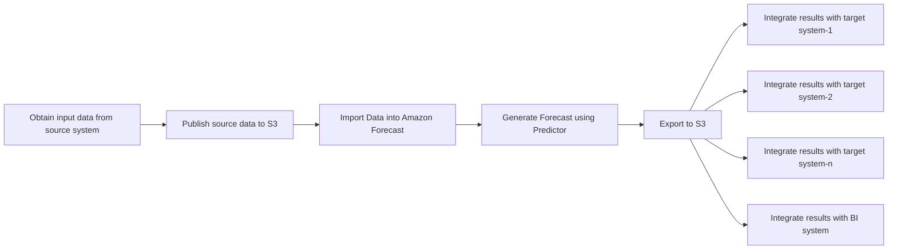
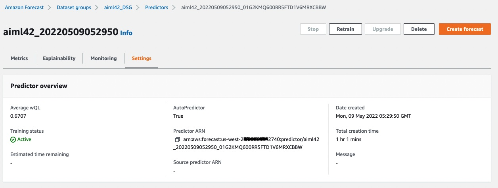
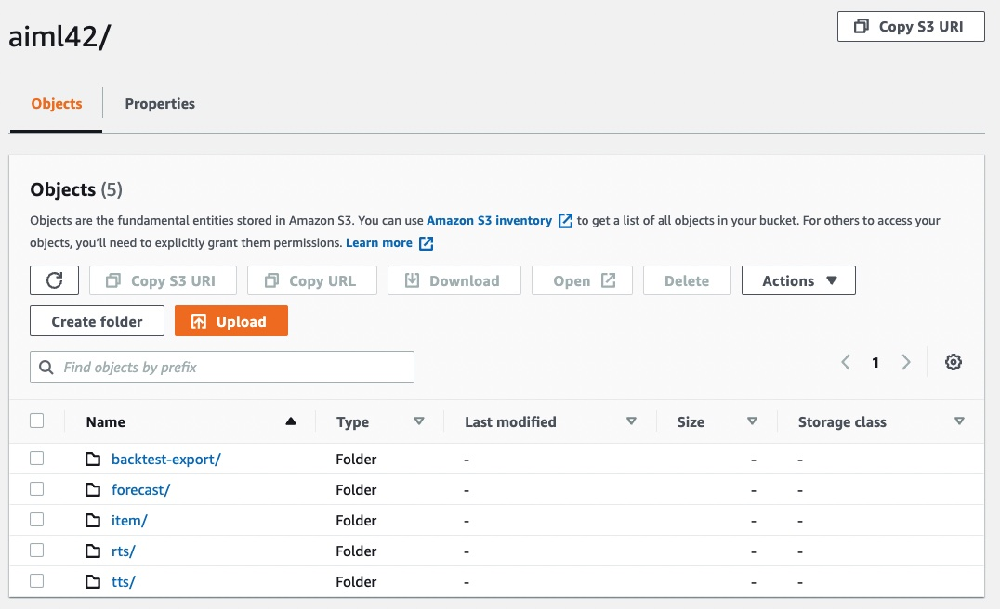

## Creating predictions using imported data and a trusted AutoPredictor

You may repeat this process as a quick start for each use case you intend to deploy.  Since each deployment is mutually exclusive of the other, you can operate each stack independently.

In a prior step at the [Solution Guidance](SolutionGuidance.md) stack creation, **StackName** parameter was given.

This page provides guidance on how to produce forecasted data points with Amazon Forecast.  Ongoing, you should harvest new data from source system(s), import the data into Amazon Forecast and then generate forecasted data points.  Optionally, you may also insert a new predictor creation after import and before forecast.

## Visualizing the process of creating production time-series forecasts using Amazon Forecast

 

## **Steps to Create Forecasted Data Points**

1. In the AWS Console, navigate to the AWS Step Functions service.  You can do this by typing S3 in the "Step Functions" control in the black menu bar and hitting enter.
2. Once in AWS Step Functions, a list of all state machines is provided.  Type the name of your StackName in the "Search for state machines" control to filter the list, if needed.
3. In the filtered list, one state machine has Create-Forecast.  Click on the link name to open this state machine.
4. Next, simply click Start Execution towards the upper-right of the screen.  
5. Click Start Execution on the secondary screen without changing anything.
6. Allow the state machine to run.  It will complete very fast because, as delivered, the system is not setup to generate a forecast and it does not know which Predictor model you, the customer have approved for inference.
7. Let's configure the system to use your trained predictor.  In Amazon Foreast, locate the ARN for your predictor, as seen in this screenshot.  You can click on the copy icon next to the ARN name.  Have this clipboard value ready in the steps ahead.

 

8. In your browser, open another tab and use the AWS Console to nagivate to Systems Manager by searching for it in the search control in the black menu bar and hitting enter.
8. Once in AWS Systems Manager, locate and click on Parameter Store in the left menu pane.
9. Inside Systems Manager, type your **StackName** to filter out parameters related to your stack, if needed.
10. Click on the name /forecast/**StackName**/Forecast/PredictorArn, where StackName is replaced with your value and then click edit.
11. In the value control, paste the copied ARN for your desired Predictor.  This is how you associate a trained predictor model with the interfence function of Forecast.
12. In the same fashion, you will edit one more parameter.  Location the name /forecast/**StackName**/Forecast/Generate and edit the value, replacing FALSE with TRUE.
13. You are ready to run a forecast job for this dataset group.  Follow steps 1-5 again, this time, the CreateForecast job will run.
14. As part of the state machine, the system will create a forecast and also run a ForecastExport job which writes out time-series predictions to S3.  These are files located in S3 "forecast" folder as shown.
  

  
10. Inside the forecast folder you will find predictions for your items, located in many CSV or Parquet files, depending on your selection.  The predictions for each time-step and selected time-series exist with all your chosen quantile values per record. You may download these files from S3, query them in place with Amazon Athena or choose another strategy to leverage the data.

This wraps up the entire workflow.

NEXT: This solution guidance provides a pattern to follow.  You will need to adapt the sample to your schema, set the forecast horizon, time resolution, and so forth according to your use case.  You will need to set a recurring schedule where data is harvested from source system(s), import the data and produce forecasts.  If desired, you may insert a predictor task between import and forecast.

Feel free to provide feedback on your experience.
