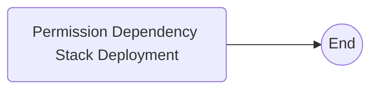
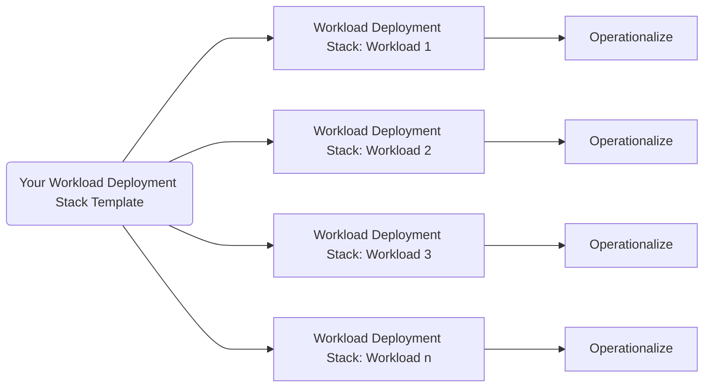

## Amazon Forecast End-to-End Deployments Made Simple

**Purpose of this Solution Guidance**  
Each week, AWS partners and customers from a wide variety of industries rely on Amazon Forecast to execute forecasting jobs and use those outcomes to make better, informed decisions to run their businesses.  
  
We are constantly innovating on behalf of customers helping to remove friction and undifferentiated heavy lifting — which in turn allows customers more time to iterate on planning from forecasted outcomes instead of focusing on the complexities of writing code to orchestrate and monitor machine learning pipelines.  
  
The purpose of this guidance is to help customers with a complete end-to-end workflow with an example template. The template can be used to create Amazon Forecast Dataset Groups, import data, train machine learning models, and produce forecasted data points, on future unseen time horizons from raw data. All of this is possible without having to write or compile code.  
  
Best of all, the template can be adjusted easily and used to deploy any number of parallel workloads your organization might want to pursue and manage.  
  
This guidance is intended to enable all parties including business analysts, technology staff, and expert machine learning practitioners alike. Removing the need to write code reduces time to market, so customers can start to use data insights to drive business outcomes. Business outcomes are the true objective, not building an ensemble of forecasting models or making sure clusters for training and producing inference are secure, scale-out properly, and include multiple state-of-the-art models.  
  
As important as being able to deploy a workflow without code — is being able to reliably execute it again each day, week, or month. The solution proposed makes the ongoing operations possible too.  
  
Your feedback for making this even easier is appreciated.

## **AWS CloudFormation helps automates deployment**

The solution guidance is deployed with [AWS CloudFormation](https://aws.amazon.com/cloudformation/), which allows customers to speed up the building and deployment of AWS infrastructure, in a repeatable way, without having to point and click each step along the way.  CloudFormation makes it easy to deploy as many Amazon Forecast workloads as you need in many parts of your business.  

There are two AWS CloudFormation templates as part of this solutions guidance.  The resulting objects created by a CloudFormation deployment are called a Stack, representing a unit of work that can be upgraded or removed as needed.

**Permission Dependency Stack Overview**
[AWS S3](https://aws.amazon.com/pm/serv-s3/) is essential for holding the input data for Amazon Forecast and optionally receiving forecasted data points produced by the service's inference process.  To address this need, the dependency template is deployed first and is executed only once.   The template makes sure all the permissions necessary to run the solution are in place and can either use an existing AWS S3 bucket or create a new one if requested.

  

**Workload Deployment Stack Overview**
The second stack is deployed for each mutually exclusive workload you wish to deploy.  You will provide a short "stack name" for each deployment, which in turn creates several [AWS Step Functions](https://aws.amazon.com/step-functions) that help coordinate the machine learning pipelines which orchestrate all the Amazon Forecast processes for each workload.

  

Begin here, with the one-time deployment of the [Dependency Stack](./DependencyStack.md)

