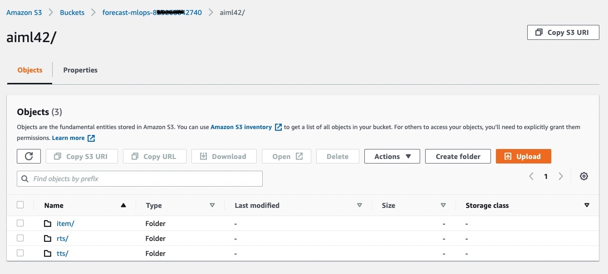

## Providing Data for your newly deployed project

You may repeat this process as a quick start for each use case you intend to deploy.  Since each deployment is mutually exclusive of the other, you can operate each stack independently.

In the prior step at the [Solution Guidance](SolutionGuidance.md) stack creation, a **S3Bucket**  and **StackName** parameter were provided.

This step provides guidance on how to deposit files on S3 in a structure the deployment is expecting.  

1. In this code repository, you will need to download the three CSV files from the [sample_data](./sample_data) folder to your laptop.
2. In the folder you downloaded the files to, create 3 folders titled item, rts, tts.  
 - [ ] Move the CSV file titled item to your item folder.
 - [ ] Move the CSV file titled rts to your rts folder
 - [ ] Move the CSV file titled tts to your tts folder

3. In the AWS Console, navigate to the S3 service.  You can do this by typing S3 in the "search for services" control in the black menu bar and hitting enter.
4. Once in S3, account buckets are listed.   Click on the bucket name you provided in the prior steps.
5. Once inside this bucket, it will be empty.  You will click "Create Folder" and provide the exact same string as your StackName.
6. Once the folder is created, click on the folder name to enter it.
7. Next, click on the orange Upload button.
8. Drag the three folders from your laptop and drop them in the S3 window waiting the upload.
9. You should see 3 files in the list of files and folders.  Click on Upload at the bottom of this page.
10. Once the upload is complete, your AWS Console should look like this; in the example, the StackName is aiml42.
  

  

NEXT: Now it's time to build your [Amazon Forecast Dataset Group](DatasetGroup.md).