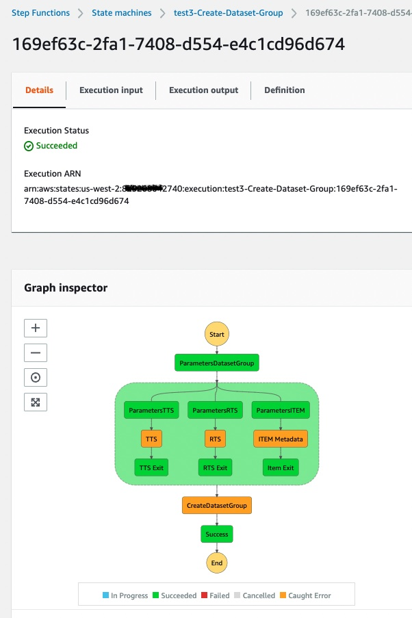

## Creating your Amazon Forecast Dataset Group

You may repeat this process as a quick start for each use case you intend to deploy.  Since each deployment is mutually exclusive from the other, you can operate each stack independently.

In a prior step at the [Solution Guidance](SolutionGuidance.md) stack creation, the **StackName** parameter was given.

This step guides how to create a dataset group as a one-time event for each workload.  Ongoing, you should plan on running the import data, create predictor and create forecast as appropriate, as a series, according to your schedule -- which could be daily, weekly, or otherwise. 

1. In the AWS Console, navigate to the AWS Step Functions service.  You can do this by typing S3 in the "Step Functions" control in the black menu bar and hitting enter.
2. Once in AWS Step Functions, a list of all state machines is provided.  Type the name of your StackName in the "Search for state machines" control to filter the list, if needed.
3. In the filtered list, one state machine has Create-Dataset-Group.  Click on the link name to open this state machine.
4. Next, simply click Start Execution towards the upper-right of the screen.  
5. Click Start Execution on the secondary screen without changing anything.
6. Allow the state machine to run, the process only takes about one minute.  When it's done, the Execution Status should move from a blue-colored Running to a green-colored Succeeded.
7. Drag the three folders from your laptop and drop them in the S3 window waiting for the upload.
8. You should see 3 files in the list of files and folders.  Click on Upload at the bottom of this page.
  

  

NEXT: Now it's time to import your staged S3 data into [Amazon Forecast](ImportData.md).