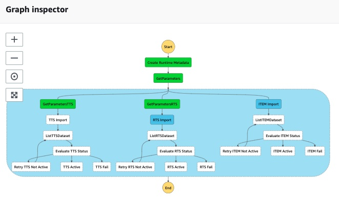

## Importing data into your Amazon Forecast Dataset Group

You may repeat this process as a quick start for each use case you intend to deploy.  Since each deployment is mutually exclusive from the other, you can operate each stack independently.

In a prior step at the [Solution Guidance](SolutionGuidance.md) stack creation, the **StackName** parameter was given.

Ongoing, you should plan on running this task just ahead of create predictor and/or create forecast as appropriate, as a series, according to your schedule -- which could be daily, weekly, or otherwise. 

1. In the AWS Console, navigate to the AWS Step Functions service.  You can do this by typing S3 in the "Step Functions" control in the black menu bar and hitting enter.
2. Once in AWS Step Functions, a list of all state machines is provided.  Type the name of your StackName in the "Search for state machines" control to filter the list, if needed.
3. In the filtered list, one state machine has Import-Dataset.  Click on the link name to open this state machine.
4. Next, simply click Start Execution towards the upper-right of the screen.  
5. Click Start Execution on the secondary screen without changing anything.
6. Allow the state machine to run, the amount of runtime can be dependent on the dataset being processed.  When it's done, the Execution Status should move from a blue-colored Running to a green-colored Succeeded.
  

  
7. While this is running, in your browser, open another tab and use the AWS Console to navigate to Amazon Forecast by typing Forecast in the search control in the black menu bar and hitting enter.
8. In Forecast, navigate to the dataset group with your **StackName** and you should see data imports are in progress.  The interface will look similar to this screenshot.

  

  

9. When the state machine for Import-Dataset is complete, you can proceed to the next step.  You may use the state of your state machine and/or the status of your AWS console to know when to move forward.

NEXT: Now it's time to build your time-series data model with [Amazon Create Auto Predictor](Predictor.md).