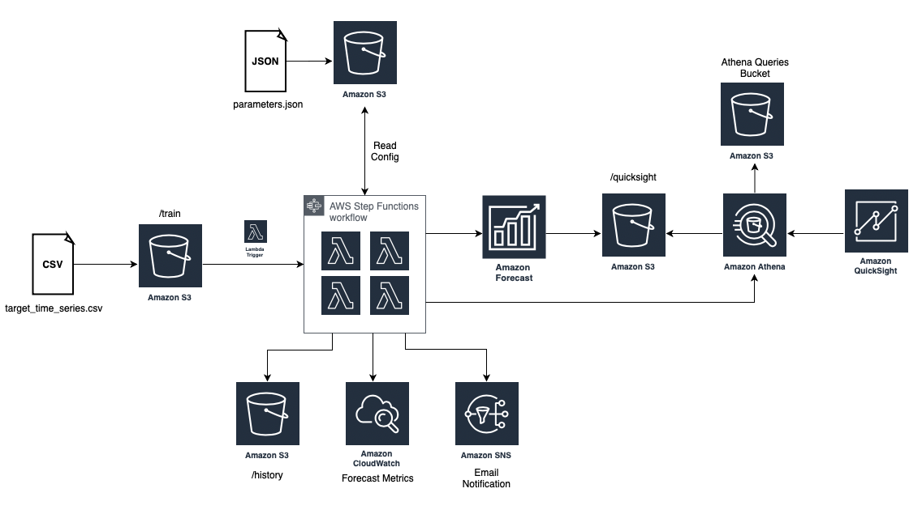
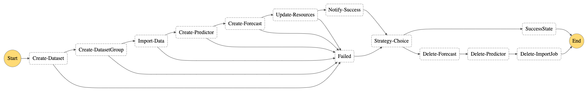

# Forecast Visualization Automation Blogpost

This package contains the source code with a StepFunctions pipeline that is able to perform
multiple actions within Amazon Forecast, including the following actions:
- Dataset creation
- Dataset import
- Predictor creation
- Forecast generation
- Data transformation 

Once the steps are completed, the solution notifies the users of its completion and deletes all unnecessary resources on Amazon Forecast, unless specified otherwise on the parameters file. We aim of this solution is to provide a way to easily get new forecasts once new data comes available. 

The solution is deployed using [AWS SAM](https://aws.amazon.com/serverless/sam/) therefore it requires minimum effort to deploy and use.

## Architecture
The following describes the architecture of the solution:



The StepFunction workflow is described below:


A description of each step functionality can be found on the [AWS Blogpost]().

## Deployment and Usage

First, clone this repository to your machine and install SAM CLI.

With the SAM CLI installed, run the following command inside this repository folder 
to deploy the pipeline:
```
sam build && sam deploy --guided
```

Once built and deployed, the solution will create 2 buckets:
- __Forecast Bucket__: Where your training and infereces are stored.
- __Athena Bucket__: Where the raw Athena queries are stored.

The name of each bucket can be found on the output section of the CloudFormation stack on the console. To see it access the CloudFormation tab on the console. If you did not change the command line, the stack name will be __ForecastSteps__.

In order to test the deployment please run the following command inside your parent directory:

```
aws s3 cp ./testing-data/params.json s3://{YOURBUCKETNAME}

aws s3 sync ./testing-data/ s3://{YOURBUCKETNAME}
```
**Note:** You will need to specify the correct S3 bucket name created before.
The step function starts upon new come available at the ```s3://ForecastBucket/train/``` folder. 

You should receive an email subscription confirmation by AWS SNS. Confirm it in order to get notifications from the Step Functions workflow. Navigate to the StepFunctions dashboard to follow the steps excecution. When the steps are completed, the __Forecast Bucket__ will have the following structure:
```
/params.json    # Your parameters file.
/train/         # Where the training csv files are stored
/history/       # Where the previous forecasts are stored
/history/raw/   # Contains the raw Amazon Forecast exported files
/history/clean/ # Contains the previous processed Amazon Forecast exported files
/quicksight/    # Contains the most upated forecasts according to the train dataset
/tmp/           # Where the Amazon Forecast files are temporarily stored before processing
```

When querying on Quicksight, we use the ```/train``` and ```/quicksight``` folders as input to Athena.

## Configuration & Settings

To start using the solution on your custom dataset, make sure to properly setup the [configuration file](testing-data/params.json). This file contains all the necessary configuration for Amazon Forecast, and should match your dataset schema and output preferences.

### Dataset Settings

The dataset settings are related to the training data for the system. You can check all the supported dataset types on this [link](https://docs.aws.amazon.com/forecast/latest/dg/howitworks-domains-ds-types.html). Please note that __the order of the Schema attributes has to match the order provided on the csv files__.

You should also specify a domain for your datasets. [This link](https://docs.aws.amazon.com/forecast/latest/dg/howitworks-domains-ds-types.html) provides you with the necessary fields for each domain.

### Predictor settings

Amazon Forecast demands you to choose between picking one desired algorithm to perform the training or performing AutoML. If you want to specify a model you can do so by adding the ```AlgorithmArn``` field on the Forecast entity. See the following table for a list of the supported algorithms __*__, followed by their respective ARN:


| Algorithm     | ARN                                       |
| ------------- | ----------------------------------------- |
| ARIMA         | arn:aws:forecast:::algorithm/ARIMA        |
| DeepAR        | arn:aws:forecast:::algorithm/Deep_AR_Plus |
| ETS           | arn:aws:forecast:::algorithm/ETS          |
| NTPS          | arn:aws:forecast:::algorithm/NPTS         |
| Prophet       | arn:aws:forecast:::algorithm/Prophet      |

__* The supported algorithm list might increase over time. Visit the [Amazon Forecast Reference Guide](https://docs.aws.amazon.com/forecast/latest/dg/aws-forecast-choosing-recipes.html) in order the get the most updated information.__ 

In addition to that, the basic configuration demands that you soecify the Forecast Horizon and the Forecast Frequency.

### Forecast Settings

As soon as your Amazon Forecast finishes the training, we need to specify the quantiles of which
to export. This can be done by using the ```ForecastTypes``` field, under ```Forecast```. It must be comprised of a list of the desired quantiles. Supported types include `'0.01'`, `'0.5'` and `'0.99'`. Every Forecast type specified at this step will be shown on the transformed dataset in the ```type``` field.

Due to how Amazon Forecast works, all strings provided on the Datasets are transformed to lower. We also add the last observations of the time series for each identifier `(item_id)` to the forecasted dataset, in order to provide better visualization.

## Visualization

To perform visualizations on the forecasted data we recommend using Athena to query the tables
already created by the StepFunctions workflow. You can merge the tables __train__ and __forecast__
using basic SQL queries and get a unified view over your training and forecasted dataset. Further
instructions on how to visualize using Amazon QuickSight will be provided by the attached [AWS Blogpost]().

```
SELECT LOWER(forecast.item_id) as item_id,
         forecast.target_value,
         date_parse(forecast.timestamp, '%Y-%m-%d %H:%i:%s') as timestamp,
         forecast.type
FROM default.forecast
UNION ALL
SELECT LOWER(train.item_id) as item_id,
         train.target_value,
         date_parse(train.timestamp, '%Y-%m-%d %H:%i:%s') as timestamp,
         'history' as type
FROM default.train
```