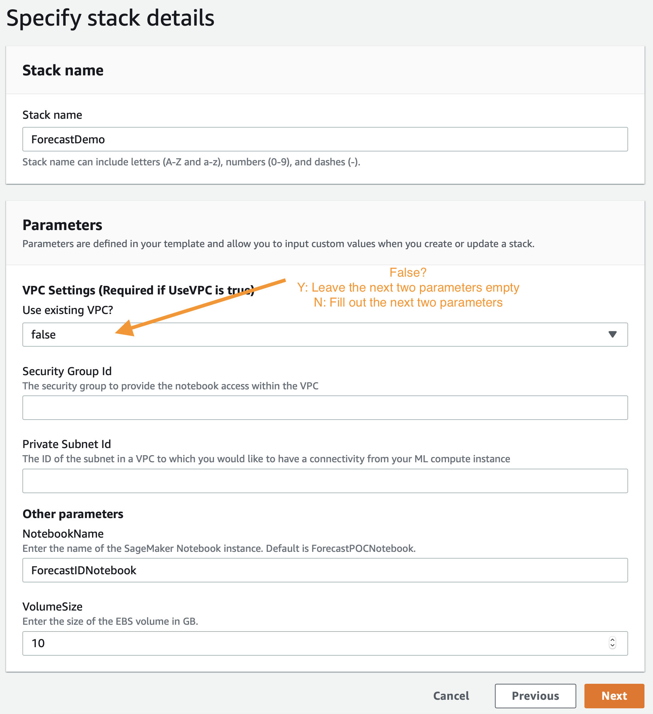
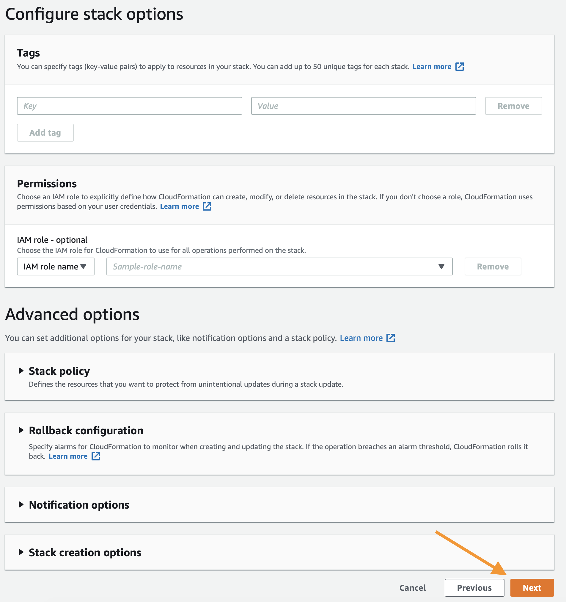
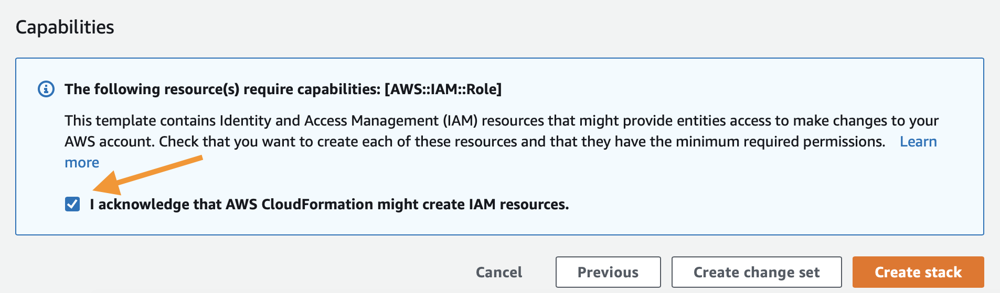
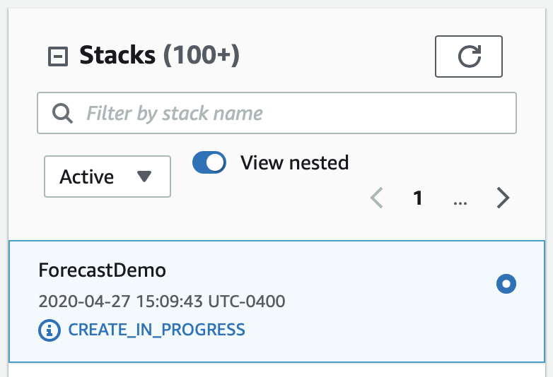

## Amazon Forecast Immersion Day

This goal of this Immersion Day is to provide a common starting point for learning how to use the various features of [Amazon Forecast](https://aws.amazon.com/forecast/). 

For detailed specifics of any concept mentioned look at the [Forecast developer guide](https://docs.aws.amazon.com/forecast/latest/dg/what-is-forecast.html)

In the Notebooks you will learn to:

1. Prepare a dataset for use with Amazon Forecast.
1. Build models based on that dataset.
1. Evaluate a model's performance based on real observations.
1. How to evaluate the value of a Forecast compared to another.

## Agenda

The steps below outline the process of building your own time-series prediction models, evaluating them, and then cleaning up all of yuour resources to prevent any unwanted charges. To get started execute the following steps.

1. Deploy the CloudFormation Template below or build a local Jupyter environment with the AWS CLI installed and configured for your IAM account.
1. [Train_Evaluate_Predictors.ipynb](notebooks/Train_Evaluate_Predictors.ipynb) - Guides you through preparing your dataset to be used with Amazon Forecast. Explains how to use the dataset you prepared to build your first model. Takes the model you just created and evaluates its performance against real observed measurements.
1. [Cleanup.ipynb](notebooks/Cleanup.ipynb) - Deletes Amazon Forecast resources and IAM role created in above notebooks.

Each notebook can be found within the `notebooks` folder in this project.

## Prerequisites 

1. An AWS Account
1. A user in the account with administrative privileges

## Outline

1. First you will deploy a CloudFormation template that will create an S3 bucket for data storage, a SageMaker Notebook Instance where the exercises are executed, IAM policies for the Notebook Instance, and it will clone this repository into the Notebook Instance so you are ready to get started.
1. Next you will open the `Train_and_Evaluate_Predictors.ipynb` to get started.
1. This notebook will guide you through the process of the other notebooks until you have a working and evaluated forecast.

## Building Your Environment:

As mentioned above, the first step is to deploy a CloudFormation template that will perform much of the initial setup work for you. In another browser window or tab, login to your AWS account. Once you have done that, open the link below in a new tab to start the process of deploying the items you need via CloudFormation.

Follow along with the screenshots below if you have any questions about deploying the stack.

### Cloud Formation Wizard

Start by clicking `Next` at the bottom like this:

In the next page you need to provide a unique S3 bucket name for your file storage, it is recommended to simply add your first name and last name to the end of the default option as shown below, after that update click `Next` again.

This page is a bit longer so scroll to the bottom to click `Next`.

Again scroll to the bottom, check the box to enable the template to create new IAM resources and then click `Create Stack`.

For a few minutes CloudFormation will be creating the resources described above on your behalf it will look like this while it is provisioning:

Once it has completed you'll see green text like below indicating that the work has been completed:

